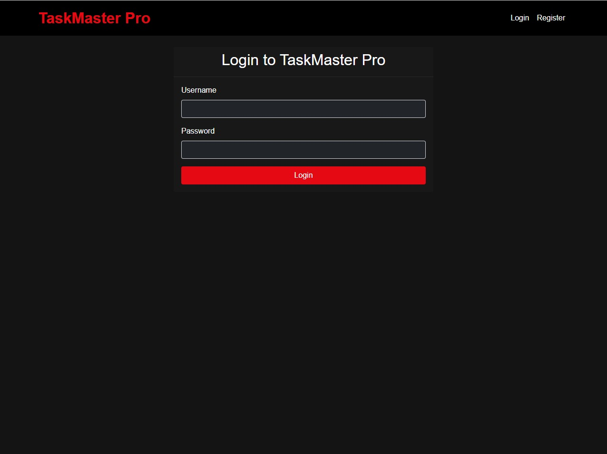
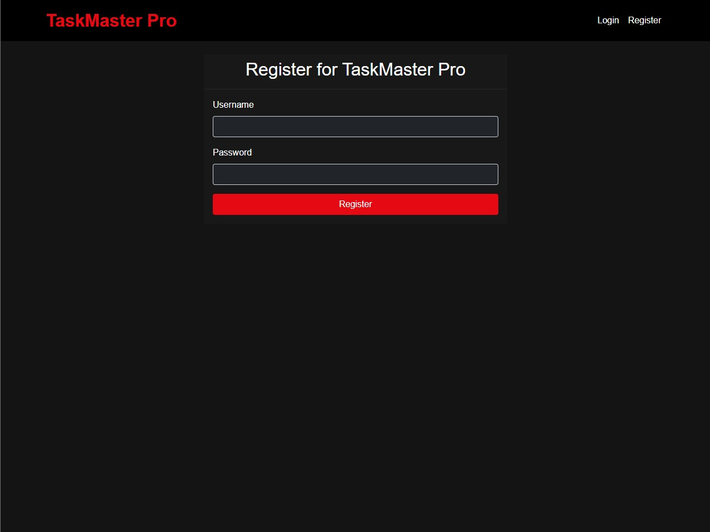
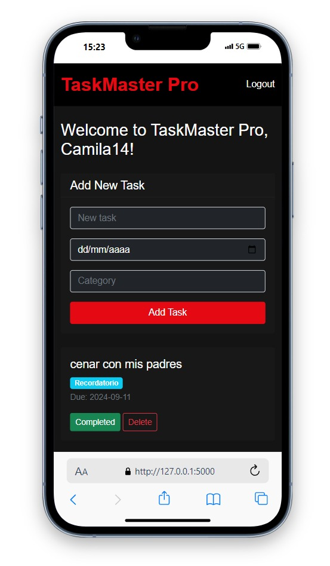
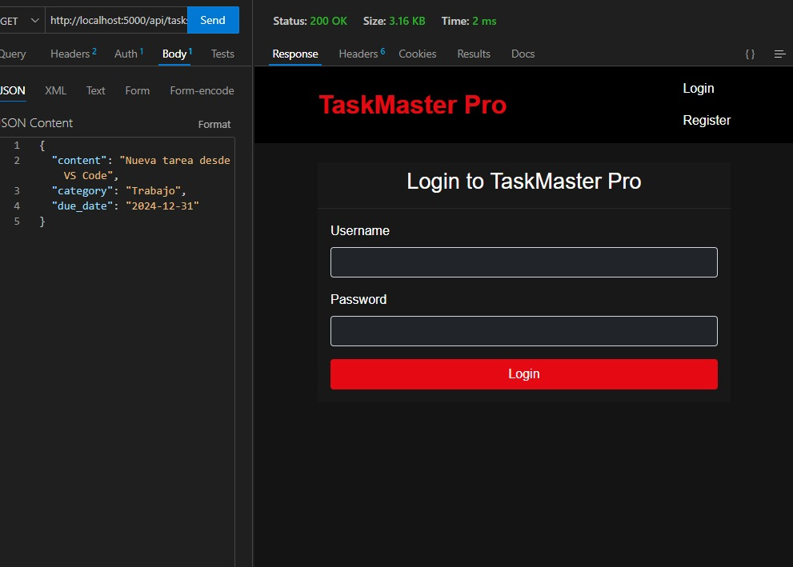

# TaskMaster Pro

#### Video Demo: [https://www.youtube.com/watch?v=stsZTSPVnDM](https://www.youtube.com/watch?v=stsZTSPVnDM)

## Description

TaskMaster Pro is an advanced web-based To-Do List application built using Flask, SQLAlchemy, and SQLite. It demonstrates a range of full-stack development skills and incorporates several features that make it stand out in the realm of task management applications.

## Features

### 1. User Authentication
The app includes a secure login and registration system, ensuring that each user has their own private task list.




### 2. Task Dashboard
After logging in, users are presented with their task dashboard. This is where users can view, add, complete, and delete tasks. Each task can have a due date and a category, allowing for better organization.

### 3. Task Management
Users can easily manage their tasks directly from the dashboard. This includes adding new tasks, marking tasks as complete, and deleting tasks.

### 4. Responsive Design
The frontend is built with Bootstrap, ensuring a mobile-friendly experience across various devices.



### 5. RESTful API
The application includes a RESTful API for task management, demonstrating the ability to create backend services.



## Technology Stack

- **Backend**: Python, Flask, SQLAlchemy
- **Frontend**: HTML5, CSS3, Bootstrap, JavaScript
- **Database**: SQLite
- **Authentication**: Flask-Login, Flask-Bcrypt
- **API**: Flask-RESTful

## Project Structure
TaskMaster-Pro/
├── app.py                # Main Flask application
├── requirements.txt      # Python dependencies
├── README.md             # Project documentation
├── templates/            # HTML templates
│   ├── base.html         # Base template
│   ├── index.html        # Main dashboard
│   ├── login.html        # Login form
│   └── register.html     # Registration form
├── images/               # Screenshots for documentation
│   ├── login.jpg         # Login page screenshot
│   ├── register.jpg      # Registration page screenshot
│   ├── mobile_view.jpg   # Mobile responsive view
│   └── api_response.jpg  # API response example
├── instance/             # Database files
│   └── taskmaster.db     # SQLite database
└── venv/                 # Virtual environment (not in repo)

## Key Components

### 1. `app.py`
The main Flask application file containing:
- User authentication logic
- Task CRUD operations
- API endpoints
- Database models for User and Task

### 2. Templates
- **`base.html`**: Base template with common layout
- **`index.html`**: Main task dashboard
- **`login.html`** & **`register.html`**: Authentication forms

### 3. Database Models
- **User Model**: Handles user authentication and data
- **Task Model**: Manages task information and relationships

## Technical Skills Demonstrated

- ✅ **Backend Development**: Python, Flask framework
- ✅ **Database Management**: SQLAlchemy ORM, SQLite
- ✅ **Frontend Development**: Responsive HTML/CSS, Bootstrap
- ✅ **Authentication**: Secure user login/registration
- ✅ **API Development**: RESTful API endpoints
- ✅ **Security**: Password hashing, session management
- ✅ **Version Control**: Git and GitHub

## Setup and Installation

### Prerequisites
- Python 3.7+
- pip (Python package installer)

### Installation Steps

1. **Clone the repository**:
   ```bash
   git clone https://github.com/kelvinmendoza59/TaskMaster-Pro.git
   cd TaskMaster-Pro

Create a virtual environment:
bashpython -m venv venv
source venv/bin/activate  # On Windows: venv\Scripts\activate

Install dependencies:
bashpip install -r requirements.txt

Initialize the database:
bashpython
>>> from app import app, db
>>> with app.app_context():
...     db.create_all()
>>> exit()

Run the application:
bashpython app.py

Access the application:
Open your browser and navigate to http://localhost:5000

API Documentation
The application provides a RESTful API for task management:
Endpoints
MethodEndpointDescriptionGET/api/tasksRetrieve all tasks for authenticated userPOST/api/tasksCreate a new taskPUT/api/tasks/<id>Update an existing taskDELETE/api/tasks/<id>Delete a task
Example API Usage
pythonimport requests

# Login to get session
session = requests.Session()
login_data = {'username': 'your_username', 'password': 'your_password'}
session.post('http://localhost:5000/login', data=login_data)

# Get all tasks
response = session.get('http://localhost:5000/api/tasks')
tasks = response.json()

# Create a new task
new_task = {
    'title': 'Complete project',
    'description': 'Finish the TaskMaster Pro application',
    'due_date': '2024-12-31',
    'category': 'Work'
}
response = session.post('http://localhost:5000/api/tasks', json=new_task)
Dependencies
Main Python packages used in this project:
Flask==2.3.3
Flask-SQLAlchemy==3.0.5
Flask-Bcrypt==1.0.1
Flask-Login==0.6.2
Flask-RESTful==0.3.10
Flask-Migrate==4.0.4
Features in Detail
Security Features

Password hashing using bcrypt
Session management with Flask-Login
Protected routes requiring authentication
CSRF protection

Database Features

User registration and authentication
Task creation with categories and due dates
Soft delete functionality
Data validation and constraints

UI/UX Features

Responsive design for mobile and desktop
Bootstrap styling for modern appearance
Interactive task management
Flash messaging for user feedback

Future Enhancements

 Task sharing between users
 Email notifications for due dates
 Calendar view integration
 Task priority levels
 Advanced filtering and search
 Export functionality (PDF, CSV)
 Dark mode theme
 Multi-language support

Testing
To run tests (when implemented):
bashpython -m pytest tests/
Contributing

Fork the repository
Create a feature branch: git checkout -b feature-name
Commit your changes: git commit -am 'Add some feature'
Push to the branch: git push origin feature-name
Submit a pull request

License
This project is licensed under the MIT License - see the LICENSE file for details.
Developer Information

Developer: Kelvin Mendoza
edX Account: kelvinmendoza309
GitHub: @kelvinmendoza59
Email: Contact via GitHub

Acknowledgments

CS50 Web Programming course for foundational knowledge
Flask documentation and community
Bootstrap for responsive design components


📝 Note: This project was developed as part of a web development portfolio to demonstrate full-stack development capabilities.
Feel free to explore the code, suggest improvements, or reach out for collaboration opportunities!
