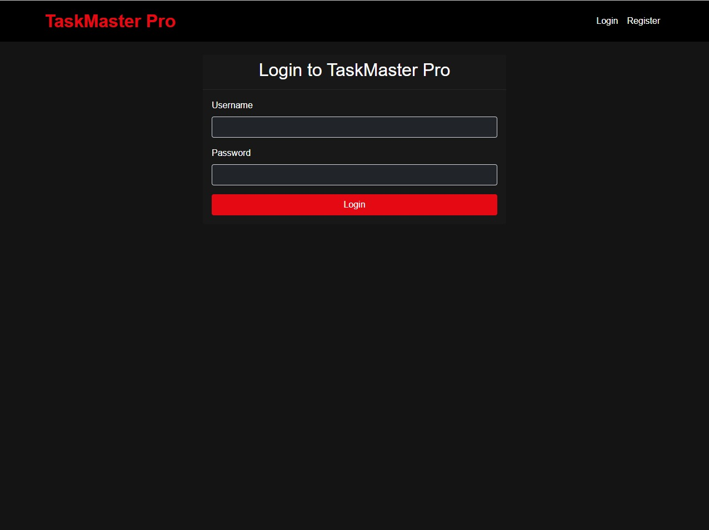
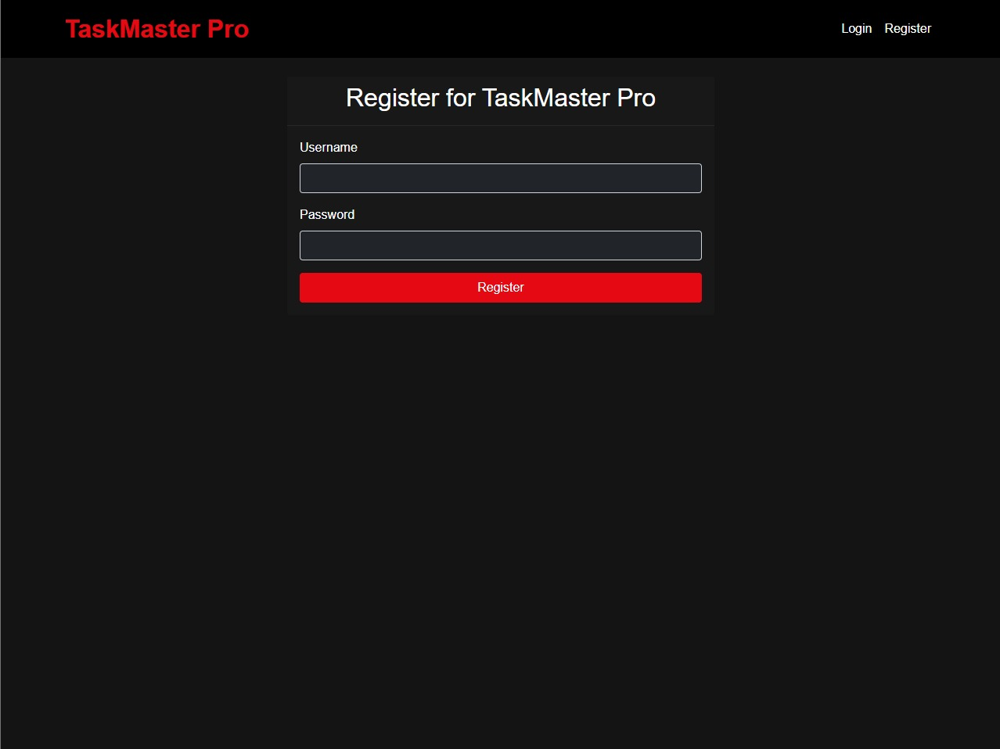
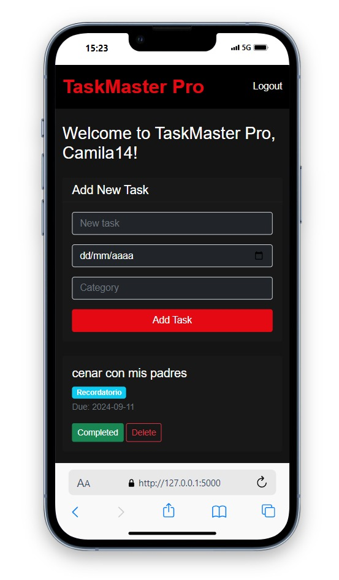
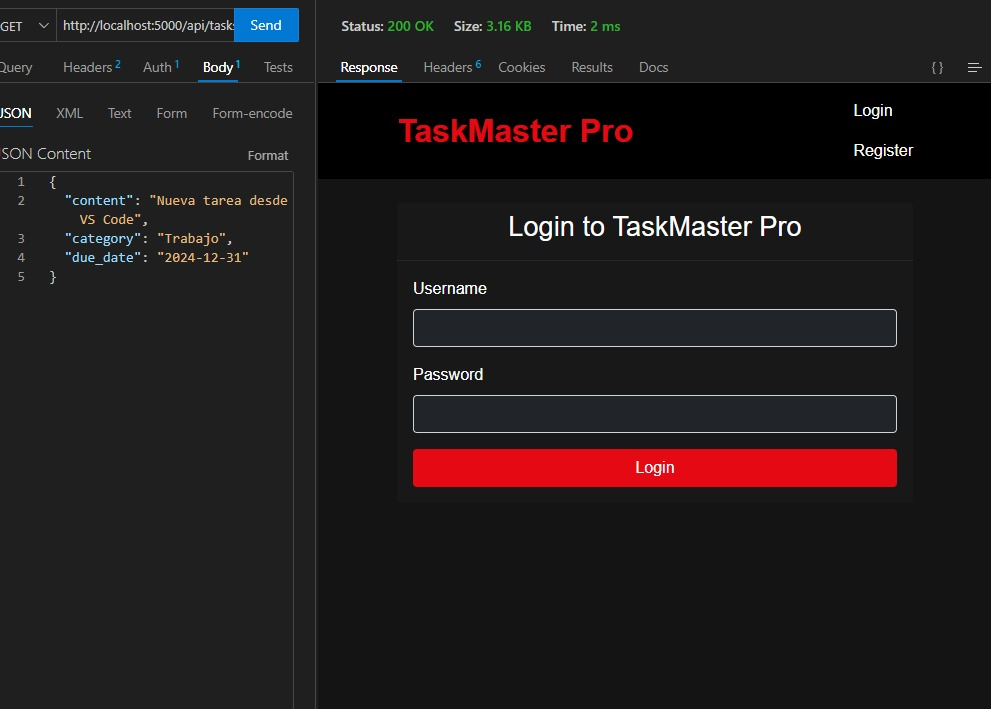

# 🎓 TaskMaster Pro

> **Final Project for [CS50x — Introduction to Computer Science](https://cs50.harvard.edu/x/) | Harvard University**

[](https://cs50.harvard.edu/x/)
[](https://python.org)
[](https://flask.palletsprojects.com/)
[](LICENSE)

## 🎥 Video Demo

📺 **[Watch the demo on YouTube](https://www.youtube.com/watch?v=stsZTSPVnDM)**

## 📋 About This Project

**TaskMaster Pro** is a full-stack web-based task management application built
as the capstone project for **Harvard's CS50x (Introduction to Computer
Science)** program. It demonstrates the application of computer science
fundamentals to a complete production-style web application.

The project integrates user authentication, database modeling, RESTful API
design, and responsive frontend — covering the full breadth of skills taught
throughout the CS50x curriculum.

## ✨ Features

### 🔐 1. User Authentication
Secure login and registration system with password hashing (bcrypt) and
session management (Flask-Login). Each user has a private, isolated task list.




### 📋 2. Task Dashboard
After logging in, users access their personal dashboard to view, add,
complete, and delete tasks. Each task supports due dates and categories
for organization.

### ⚙️ 3. Task Management
Full CRUD operations directly from the dashboard — create new tasks, mark
tasks as complete, and delete tasks with proper validation and error handling.

### 📱 4. Responsive Design
Bootstrap-based frontend providing a mobile-friendly experience across
all device sizes.



### 🔌 5. RESTful API
Complete REST API for programmatic task management, demonstrating backend
service design and API endpoint architecture.



## 🛠️ Technology Stack

| Layer | Technologies |
|-------|--------------|
| **Backend** | Python · Flask · SQLAlchemy ORM |
| **Frontend** | HTML5 · CSS3 · Bootstrap · JavaScript |
| **Database** | SQLite |
| **Authentication** | Flask-Login · Flask-Bcrypt |
| **API** | Flask-RESTful |
| **Migrations** | Flask-Migrate |

## 📁 Project Structure

```
TaskMaster-Pro/
├── app.py                # Main Flask application
├── requirements.txt      # Python dependencies
├── README.md             # Project documentation
├── templates/            # HTML templates
│   ├── base.html         # Base template
│   ├── index.html        # Main dashboard
│   ├── login.html        # Login form
│   └── register.html     # Registration form
├── images/               # Documentation screenshots
│   ├── login.jpg
│   ├── register.jpg
│   ├── mobile_view.jpg
│   └── api_response.jpg
└── instance/             # Database files
    └── taskmaster.db     # SQLite database
```

## 🧠 Key Components

### `app.py` — Application Core
- User authentication logic
- Task CRUD operations
- API endpoint definitions
- Database models (User, Task)

### Templates
- **`base.html`** — Shared layout with common navigation
- **`index.html`** — Main task dashboard
- **`login.html`** & **`register.html`** — Authentication forms

### Database Models
- **User Model** — Authentication data and user-task relationships
- **Task Model** — Task data, categories, due dates, soft delete

## 🎯 Computer Science Concepts Applied

This project demonstrates concepts learned across the CS50x curriculum:

- ✅ **Web Development** — HTTP, sessions, form handling
- ✅ **Databases** — Schema design, ORM, foreign keys, transactions
- ✅ **Security** — Password hashing, session management, CSRF protection
- ✅ **API Design** — RESTful principles, HTTP methods, JSON serialization
- ✅ **Software Engineering** — Modular code organization, separation of concerns
- ✅ **Version Control** — Git workflow with meaningful commits

## 🚀 Setup and Installation

### Prerequisites
- Python 3.7+
- pip (Python package installer)

### Installation Steps

1. **Clone the repository**
   ```bash
   git clone https://github.com/kelvinmendoza59/TaskMaster-Pro.git
   cd TaskMaster-Pro
   ```

2. **Create a virtual environment**
   ```bash
   python -m venv venv
   source venv/bin/activate  # On Windows: venv\Scripts\activate
   ```

3. **Install dependencies**
   ```bash
   pip install -r requirements.txt
   ```

4. **Initialize the database**
   ```bash
   python
   >>> from app import app, db
   >>> with app.app_context():
   ...     db.create_all()
   >>> exit()
   ```

5. **Run the application**
   ```bash
   python app.py
   ```

6. **Access the application**
   Open your browser at http://localhost:5000

## 🔌 API Documentation

### Endpoints

| Method | Endpoint | Description |
|--------|----------|-------------|
| `GET` | `/api/tasks` | Retrieve all tasks for authenticated user |
| `POST` | `/api/tasks` | Create a new task |
| `PUT` | `/api/tasks/<id>` | Update an existing task |
| `DELETE` | `/api/tasks/<id>` | Delete a task |

### Example API Usage

```python
import requests

# Login to get session
session = requests.Session()
login_data = {'username': 'your_username', 'password': 'your_password'}
session.post('http://localhost:5000/login', data=login_data)

# Get all tasks
response = session.get('http://localhost:5000/api/tasks')
tasks = response.json()

# Create a new task
new_task = {
    'title': 'Complete project',
    'description': 'Finish the TaskMaster Pro application',
    'due_date': '2024-12-31',
    'category': 'Work'
}
response = session.post('http://localhost:5000/api/tasks', json=new_task)
```

## 📦 Dependencies

```
Flask==2.3.3
Flask-SQLAlchemy==3.0.5
Flask-Bcrypt==1.0.1
Flask-Login==0.6.2
Flask-RESTful==0.3.10
Flask-Migrate==4.0.4
```

## 🔒 Security Features

- Password hashing with **bcrypt**
- Session management via **Flask-Login**
- Protected routes requiring authentication
- CSRF protection
- SQL injection prevention through SQLAlchemy ORM

## 📜 License

This project is licensed under the MIT License — see the [LICENSE](LICENSE) file for details.

## 👨‍💻 Developer

**Kelvin Mendoza**
- GitHub: [@kelvinmendoza59](https://github.com/kelvinmendoza59)

## 🙏 Acknowledgments

- **CS50 staff at Harvard University** for the foundational curriculum
- **CS50 community** on edX for support throughout the program
- **Flask & SQLAlchemy** documentation and community
- **Bootstrap** for responsive design components

---

> 🎓 *Built as the final project for [CS50x](https://cs50.harvard.edu/x/) — Harvard University's introduction to the intellectual enterprises of computer science and the art of programming.*
